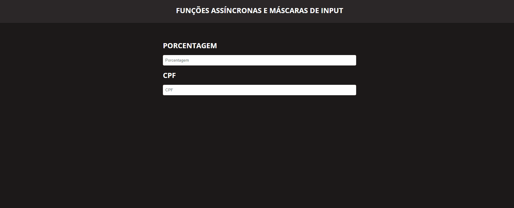

# Desafios

Aqui foram feitos 3 desafios que se consistiam em:

### Implementar Funções Assíncronas <br>
Conforme as Especificações a seguir:
Implemente uma função que receba como parâmetro um número e, após x milissegundos (dentre um intervalo de 1 a 100 ms. Utilize o `setTimeout` e as funções `floor` e `random` da biblioteca [Math](https://developer.mozilla.org/pt-BR/docs/Web/JavaScript/Reference/Global_Objects/Math)), mostre no console o dobro do parâmetro recebido. Em seguida, chame essa função 5 vezes. Ex.:

```js
function printDouble(number){
  setTimeout(
    () => {
      console.log(number * 2)
    }, 
    Math.floor(Math.random() * 100) + 1
  )
}
function printAll(){
  printDouble(5)
  printDouble(10)
  printDouble(22)
  printDouble(1)
  printDouble(89)
}
printAll()
```

Sem realizar nenhum tratamento, é fácil perceber que a ordem dos valores mostrados no console ao chamar a função `printAll()` é aleatória e não respeita a ordem de chamada das funções. Portanto, para resolver esse problema, trate o assincronismo do `setTimeout` utilizando [callback](https://developer.mozilla.org/pt-BR/docs/Glossario/Callback_function), [Promise](https://developer.mozilla.org/pt-BR/docs/Web/JavaScript/Reference/Global_Objects/Promise) e [async/await](https://developer.mozilla.org/pt-BR/docs/Web/JavaScript/Reference/Operators/await).

(Dica: no tratamento com Promise, faça o retorno de uma nova Promise e utilize o parâmetro `resolve`).

Agora, altere um pouco sua função. Serão passados dois parâmetros, o primeiro será o valor a ser dobrado e o segundo o valor a ser somado ao dobro do primeiro. Além disso, em vez de mostrar o resultado no console, retorne-o e o repasse na chamada da função seguinte, por exemplo:

```js
let result;
result = funcao(5, 0); // retorna 10
result = funcao(12, result); // retorna 34
result = funcao(2, result); // retorna 38
```

Por fim, faça novamente o tratamento desse assincronismo utilizando utilizando [callback](https://developer.mozilla.org/pt-BR/docs/Glossario/Callback_function), [Promise](https://developer.mozilla.org/pt-BR/docs/Web/JavaScript/Reference/Global_Objects/Promise) e [async/await](https://developer.mozilla.org/pt-BR/docs/Web/JavaScript/Reference/Operators/await).

### DBML

Modelar um banco de dados que represente um sistema de locação de carros. Respeite as seguintes regras:

- O BD deve possuir no mínimo 6 tabelas:
  - `customers` - clientes que alugam os carros;
  - `agencies` - agências que locam os carros;
  - `addresses` - endereço da agência (rua, bairro, etc);
  - `cars` - informações específicas do carro (cor, placa, etc);
  - `models` - informações gerais do carro (marca, modelo, etc);
  - `orders` - pedidos de locação.
- Todos as tabelas devem possuir uma primary key;
- Todas as tabelas precisam possuir, no mínimo, 5 campos (exceto a tabela resultante do relacionamento n:m);
- O relacionamento entre agência e endereço deve ser 1:1;
- O relacionamento entre modelo e carro deve ser 1:n;
- O relacionamento entre cliente e pedido deve ser 1:n;
- O relacionamento entre agência e pedido deve ser 1:n;
- O relacionamento entre carro e pedido deve ser n:m (um mesmo pedido pode abranger múltiplos carros e o mesmo carro pode ter sido locado mais de uma vez);

### Mascara de Input - Cpf & Porcentagem <br>

- Número percentual com no mínimo duas casas após a vírgula e no máximo 4 (foi utilizado o `NumberFormat` da biblioteca [Intl](https://developer.mozilla.org/pt-BR/docs/Web/JavaScript/Reference/Global_Objects/NumberFormat));
- CPF (xxx.xxx.xxx-xx).

## 💻 Como executar:

1.  **Clone o projeto.**

    ```shell
    git clone https://github.com/joaopa12/Functions
    ```

2.  **Instalação**

    Instale as dependencias da aplicação.

    ```shell
    npm install
    ```

3.  **Rode a Aplicação**

    ```shell
    npm start
    ``` 
  <br>   
 

 ## ℹ️ Resultado:
 
